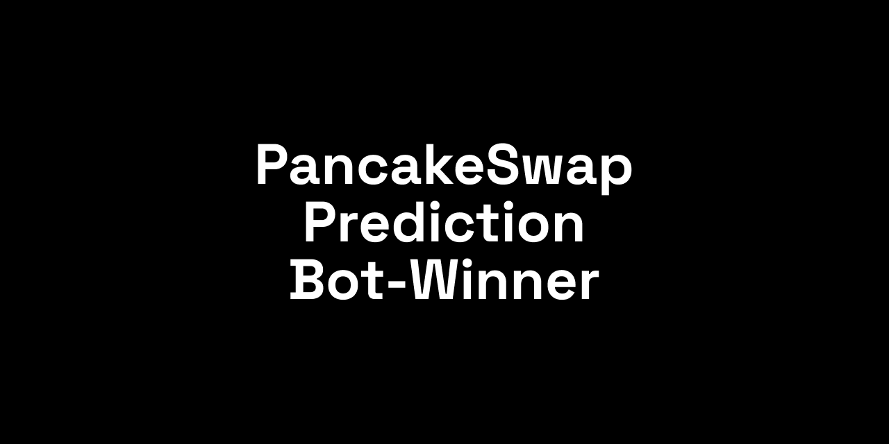
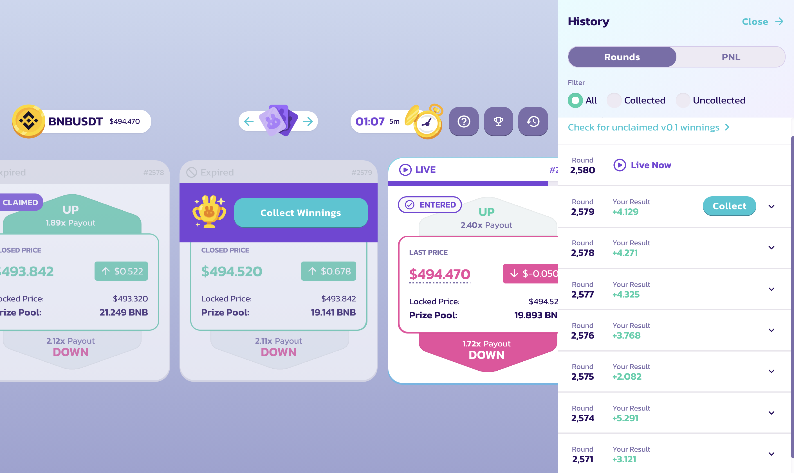
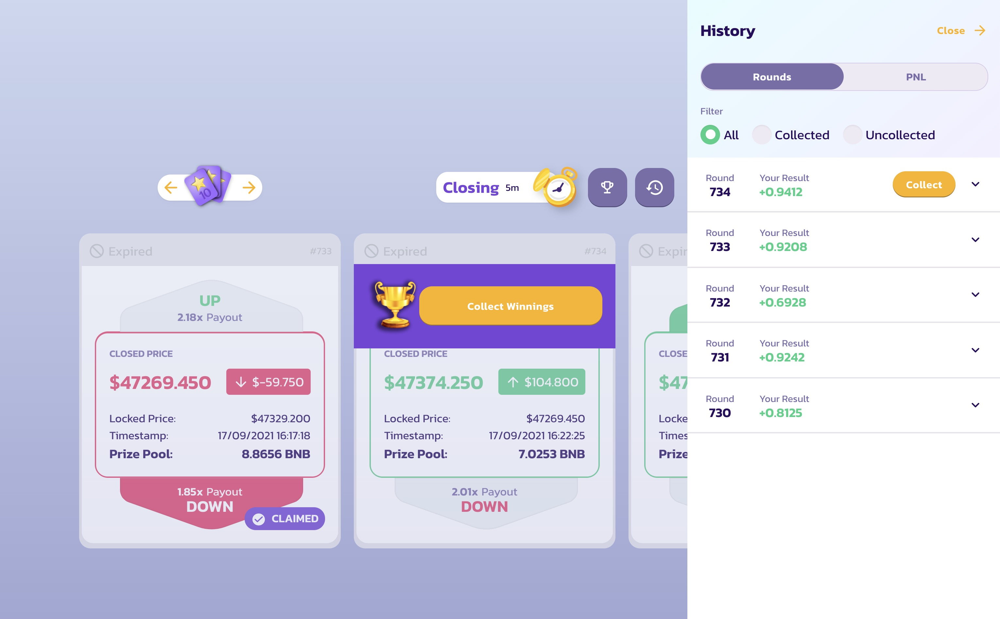

# [🔥 UPDATE V2] PancakeSwapPredictionBot Light


## ❌ DO NOT USE THIS BOT, IMPROVED NEW VERSION: https://github.com/xBidi/PancakeSwapBot

It works with PancakePredictionV2 (https://pancakeswap.finance/prediction)

⚠️ Beware of forks. I do not give any guarantee that the fork may turn out to be a scam.

💥 Disclaimer

I'm coding this stuff on a pure open source, every time the bot wins, it donates a small portion of your winnings to a developer account so we can continue improving this bot.

0xC3c531bE09102E84D4273984E29e827D71e28Ae8

### [Donate with Trust Wallet](https://link.trustwallet.com/send?asset=c20000714&address=0xC3c531bE09102E84D4273984E29e827D71e28Ae8)

All investment strategies and investments involve risk of loss. Nothing contained in this program, scripts, code or repository should be construed as investment advice. Any reference to an investment's past or potential performance is not, and should not be construed as, a recommendation or as a guarantee of any specific outcome or profit. By using this program you accept all liabilities, and that no claims can be made against the developers or others connected with the program.

## 💡 How to use

```
1. Rename .env.example to .env: `mv .env.example .env`
2. Provide your private key to .env PRIVATE_KEY field
3. Install dependencies npm i
4. Start the app with `npm run start`
5. Enjoy winning!
```




